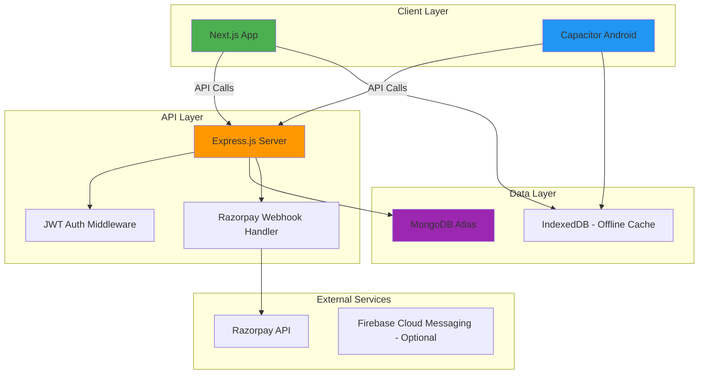
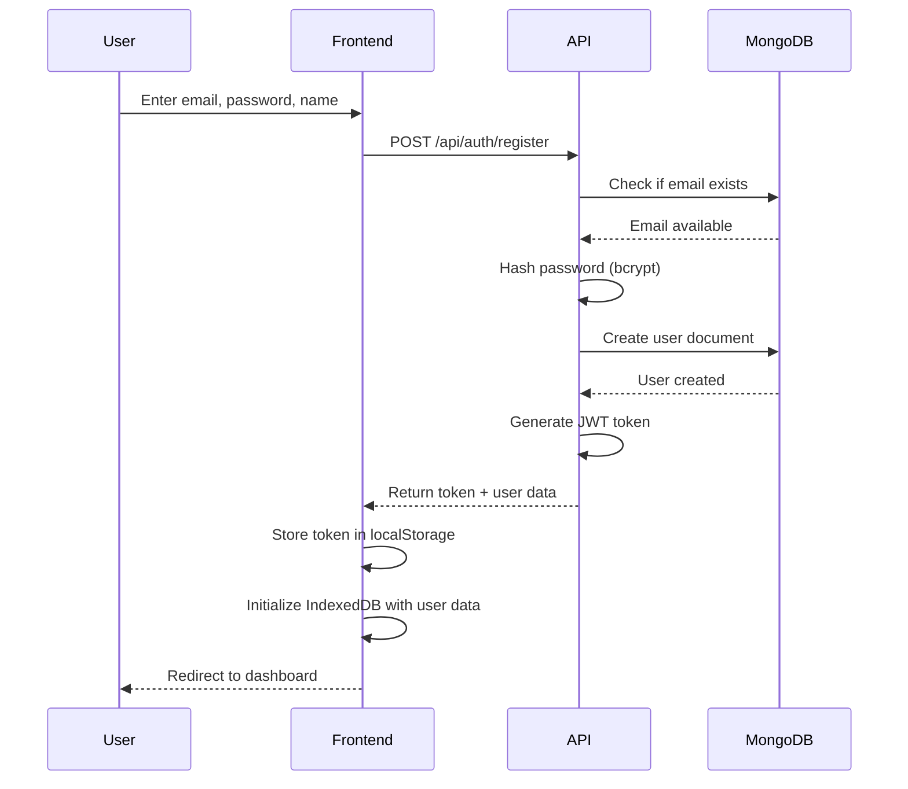
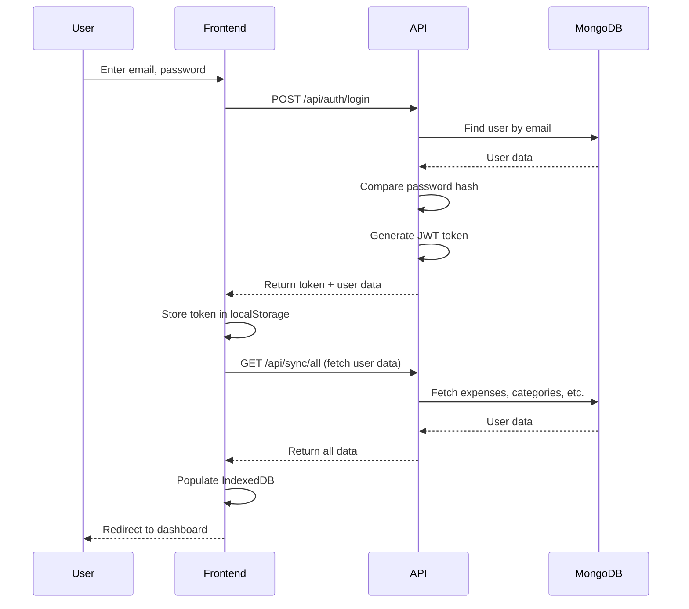
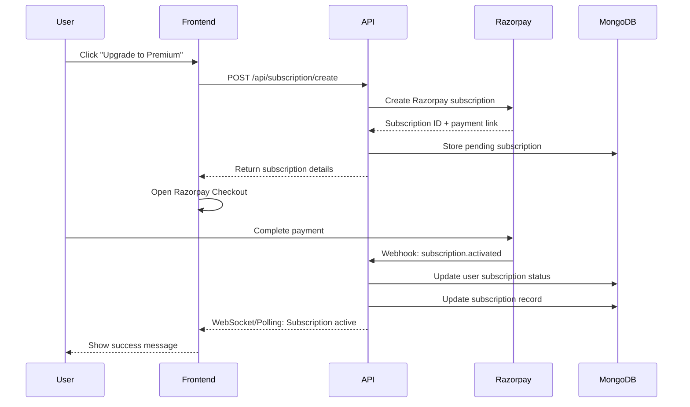

# VerdantView Migration Plan: Full-Stack Subscription-Based App

## Executive Summary

This plan outlines the migration of **VerdantView** from a localStorage-based Next.js expense tracker to a comprehensive full-stack subscription-based application with:

- **Authentication System** (JWT-based)
- **MongoDB Backend** with Express.js API
- **Razorpay Payment Integration** for subscriptions
- **Capacitor** for Android app conversion
- **Hybrid Data Strategy** (offline-first with cloud sync)

---

## 🎯 Project Goals

1. **User Authentication**: Secure login/signup with JWT tokens
2. **Cloud Data Persistence**: MongoDB for cross-device data sync
3. **Subscription Management**: Razorpay integration for premium features
4. **Mobile App**: Convert Next.js to Android app using Capacitor
5. **Offline Support**: Maintain offline functionality with sync capability
6. **Future-Ready Architecture**: Scalable for UPI payment validation features

---

## 📋 Current State Analysis

### Existing Features

- ✅ Expense/Income tracking
- ✅ Category management
- ✅ Budget monitoring
- ✅ Reminders system
- ✅ Savings tracker
- ✅ Statistics & analytics
- ✅ Data import/export
- ✅ Dark mode support
- ✅ PWA capabilities

### Current Tech Stack

- **Frontend**: Next.js 16, React 19, TypeScript
- **Styling**: Tailwind CSS, shadcn/ui
- **Storage**: IndexedDB (via `db.ts`)
- **State**: React hooks
- **Charts**: Recharts

---

## 🏗️ Target Architecture



---

## 🛠️ Technology Stack

### Frontend (No Changes)

- **Framework**: Next.js 16 with App Router
- **Language**: TypeScript
- **UI Library**: React 19
- **Styling**: Tailwind CSS + shadcn/ui
- **State Management**: React Context + Hooks
- **Offline Storage**: IndexedDB (dual-mode with API)

### Backend (New)

- **Runtime**: Node.js 20+
- **Framework**: Express.js
- **Language**: TypeScript
- **Database**: MongoDB Atlas
- **ODM**: Mongoose
- **Authentication**: JWT (jsonwebtoken)
- **Password Hashing**: bcryptjs
- **Validation**: Zod
- **API Documentation**: Swagger/OpenAPI (optional)

### Mobile (New)

- **Framework**: Capacitor 6
- **Plugins**:
  - `@capacitor/app`
  - `@capacitor/splash-screen`
  - `@capacitor/status-bar`
  - `@capacitor/network` (for sync detection)
  - `@capacitor/push-notifications` (future)

### Payment Integration

- **Provider**: Razorpay
- **SDK**: `razorpay` (Node.js)
- **Client**: Razorpay Checkout.js

### DevOps & Deployment

- **Backend Hosting**: Railway / Render / DigitalOcean
- **Frontend Hosting**: Vercel (existing)
- **Database**: MongoDB Atlas (Free tier → Paid)
- **Android Build**: Capacitor CLI + Android Studio
- **CI/CD**: GitHub Actions (optional)

---

## 📊 Database Schema Design

### User Collection

```typescript
{
  _id: ObjectId,
  email: string (unique, indexed),
  password: string (hashed),
  name: string,
  createdAt: Date,
  updatedAt: Date,

  // Subscription fields
  subscriptionStatus: 'free' | 'premium' | 'expired',
  subscriptionId: string?, // Razorpay subscription ID
  subscriptionStartDate: Date?,
  subscriptionEndDate: Date?,

  // Settings
  settings: {
    monthlyBudget: number,
    emergencyFundGoal: number,
    emergencyFundCurrent: number,
    userName: string,
    theme: 'light' | 'dark' | 'system'
  },

  // Metadata
  lastSyncAt: Date,
  deviceIds: string[] // For multi-device support
}
```

### Expense Collection

```typescript
{
  _id: ObjectId,
  userId: ObjectId (indexed),
  title: string,
  amount: number,
  category: string,
  type: 'income' | 'expense',
  paymentMode: string,
  date: Date (indexed),
  notes: string?,
  createdAt: Date,
  updatedAt: Date,
  syncedAt: Date // For conflict resolution
}
```

### Category Collection

```typescript
{
  _id: ObjectId,
  userId: ObjectId (indexed),
  name: string,
  isDefault: boolean, // System categories
  createdAt: Date
}
```

### Reminder Collection

```typescript
{
  _id: ObjectId,
  userId: ObjectId (indexed),
  title: string,
  date: Date (indexed),
  isRecurring: boolean,
  repeatInterval: number?,
  lastTriggered: Date?,
  createdAt: Date
}
```

### SavingsTransaction Collection

```typescript
{
  _id: ObjectId,
  userId: ObjectId (indexed),
  amount: number,
  type: 'deposit' | 'withdrawal',
  date: Date (indexed),
  notes: string?,
  createdAt: Date
}
```

### Subscription Collection (for Razorpay tracking)

```typescript
{
  _id: ObjectId,
  userId: ObjectId (indexed),
  razorpaySubscriptionId: string (unique),
  razorpayPlanId: string,
  status: 'created' | 'active' | 'paused' | 'cancelled' | 'expired',
  currentStart: Date,
  currentEnd: Date,
  nextBillingAt: Date?,
  amount: number,
  currency: string,
  createdAt: Date,
  updatedAt: Date
}
```

---

## 🔐 Authentication Flow

### Registration Flow



### Login Flow



### Token Refresh Strategy

- **Access Token**: 15 minutes expiry
- **Refresh Token**: 7 days expiry (stored in httpOnly cookie)
- **Auto-refresh**: Axios interceptor handles token refresh

---

## 💳 Razorpay Integration

### Subscription Plans

| Plan                | Price     | Features                                      | Duration  |
| ------------------- | --------- | --------------------------------------------- | --------- |
| **Free**            | ₹0        | Basic tracking, 100 transactions/month        | Forever   |
| **Premium Monthly** | ₹99/month | Unlimited transactions, cloud sync, analytics | 1 month   |
| **Premium Yearly**  | ₹999/year | All premium + priority support                | 12 months |

### Payment Flow



### Razorpay Webhook Events

- `subscription.activated` - Subscription started
- `subscription.charged` - Payment successful
- `subscription.cancelled` - User cancelled
- `subscription.paused` - Payment failed
- `subscription.resumed` - Reactivated
- `subscription.completed` - Subscription ended

---

## 🔄 Data Sync Strategy

### Hybrid Approach: Offline-First with Cloud Sync

#### Sync Mechanism

1. **Local-First**: All operations write to IndexedDB first
2. **Background Sync**: Queue API calls when online
3. **Conflict Resolution**: Last-write-wins with timestamp
4. **Periodic Sync**: Every 5 minutes when app is active

#### Sync Flow

```typescript
// Pseudo-code for sync logic
async function syncExpense(expense: Expense) {
  // 1. Save to IndexedDB immediately
  await addExpenseLocal(expense);

  // 2. Queue for sync
  if (navigator.onLine) {
    try {
      const response = await api.post("/api/expenses", expense);
      // Update local record with server ID
      await updateExpenseLocal({ ...expense, _id: response.data._id });
    } catch (error) {
      // Queue for retry
      await addToSyncQueue("expenses", "create", expense);
    }
  } else {
    // Offline: queue for later
    await addToSyncQueue("expenses", "create", expense);
  }
}
```

#### Sync Queue Table (IndexedDB)

```typescript
{
  id: number (auto-increment),
  collection: 'expenses' | 'categories' | 'reminders' | 'savings',
  operation: 'create' | 'update' | 'delete',
  data: any,
  timestamp: Date,
  retryCount: number,
  status: 'pending' | 'processing' | 'failed'
}
```

---

## 📱 Capacitor Android Conversion

### Setup Steps

1. **Install Capacitor**

```bash
npm install @capacitor/core @capacitor/cli
npm install @capacitor/android
npx cap init
```

2. **Configure `capacitor.config.ts`**

```typescript
import { CapacitorConfig } from "@capacitor/cli";

const config: CapacitorConfig = {
  appId: "com.verdantview.app",
  appName: "VerdantView",
  webDir: "out", // Next.js static export
  server: {
    androidScheme: "https",
  },
  plugins: {
    SplashScreen: {
      launchShowDuration: 2000,
      backgroundColor: "#10b981",
      showSpinner: false,
    },
  },
};

export default config;
```

3. **Modify `next.config.ts` for Static Export**

```typescript
const nextConfig = {
  output: "export", // Enable static export
  images: {
    unoptimized: true, // Required for static export
  },
  trailingSlash: true, // Better compatibility
};
```

4. **Build & Sync**

```bash
npm run build
npx cap add android
npx cap sync
npx cap open android
```

### Android-Specific Considerations

#### Network Detection

```typescript
import { Network } from "@capacitor/network";

const checkNetworkStatus = async () => {
  const status = await Network.getStatus();
  if (status.connected) {
    // Trigger sync
    await syncAllData();
  }
};

// Listen for network changes
Network.addListener("networkStatusChange", (status) => {
  if (status.connected) {
    syncAllData();
  }
});
```

#### Push Notifications (Future)

```typescript
import { PushNotifications } from "@capacitor/push-notifications";

// For reminder notifications
await PushNotifications.requestPermissions();
```

---

## 🚀 Implementation Phases

### Phase 1: Backend Setup (Week 1-2)

- [ ] Initialize Express.js project with TypeScript
- [ ] Set up MongoDB Atlas cluster
- [ ] Create Mongoose models
- [ ] Implement authentication endpoints
  - [ ] POST `/api/auth/register`
  - [ ] POST `/api/auth/login`
  - [ ] POST `/api/auth/refresh`
  - [ ] POST `/api/auth/logout`
- [ ] Create JWT middleware
- [ ] Set up error handling middleware
- [ ] Configure CORS for Next.js app
- [ ] Deploy to Railway/Render

### Phase 2: API Development (Week 2-3)

- [ ] Implement CRUD endpoints for:
  - [ ] Expenses (`/api/expenses`)
  - [ ] Categories (`/api/categories`)
  - [ ] Reminders (`/api/reminders`)
  - [ ] Savings (`/api/savings`)
  - [ ] Settings (`/api/settings`)
- [ ] Add pagination & filtering
- [ ] Implement bulk operations
- [ ] Create sync endpoint (`/api/sync/all`)
- [ ] Add request validation (Zod)
- [ ] Write API tests (Jest + Supertest)

### Phase 3: Razorpay Integration (Week 3-4)

- [ ] Create Razorpay account
- [ ] Set up subscription plans
- [ ] Implement subscription endpoints
  - [ ] POST `/api/subscription/create`
  - [ ] GET `/api/subscription/status`
  - [ ] POST `/api/subscription/cancel`
- [ ] Create webhook handler (`/api/webhooks/razorpay`)
- [ ] Implement signature verification
- [ ] Test payment flow in sandbox
- [ ] Add subscription status checks to API middleware

### Phase 4: Frontend Migration (Week 4-5)

- [ ] Create API client service (`lib/api.ts`)
- [ ] Implement authentication context
- [ ] Create login/signup pages
- [ ] Migrate `db.ts` to hybrid mode
  - [ ] Add sync queue functionality
  - [ ] Implement background sync
  - [ ] Add conflict resolution
- [ ] Update all components to use API
- [ ] Add loading states & error handling
- [ ] Implement subscription UI
  - [ ] Pricing page
  - [ ] Payment modal
  - [ ] Subscription status indicator
- [ ] Add network status indicator
- [ ] Test offline functionality

### Phase 5: Capacitor Setup (Week 5-6)

- [ ] Configure Next.js for static export
- [ ] Install Capacitor dependencies
- [ ] Create Android project
- [ ] Configure app icons & splash screen
- [ ] Test app on Android emulator
- [ ] Implement native features
  - [ ] Network detection
  - [ ] Status bar customization
  - [ ] App lifecycle handling
- [ ] Build signed APK
- [ ] Test on physical device

### Phase 6: Testing & Optimization (Week 6-7)

- [ ] End-to-end testing
  - [ ] Authentication flows
  - [ ] Data sync scenarios
  - [ ] Payment integration
  - [ ] Offline mode
- [ ] Performance optimization
  - [ ] API response caching
  - [ ] Lazy loading
  - [ ] Image optimization
- [ ] Security audit
  - [ ] JWT token security
  - [ ] API rate limiting
  - [ ] Input sanitization
- [ ] User acceptance testing

### Phase 7: Deployment & Launch (Week 7-8)

- [ ] Deploy backend to production
- [ ] Configure production MongoDB
- [ ] Set up Razorpay production keys
- [ ] Deploy frontend to Vercel
- [ ] Submit app to Google Play Store
- [ ] Create user documentation
- [ ] Set up monitoring (Sentry, LogRocket)
- [ ] Launch marketing campaign

---

## 📁 Project Structure

```
VerdantView/
├── frontend/                 # Next.js app (existing)
│   ├── src/
│   │   ├── app/
│   │   ├── components/
│   │   ├── lib/
│   │   │   ├── api.ts       # NEW: API client
│   │   │   ├── auth.ts      # NEW: Auth helpers
│   │   │   ├── db.ts        # MODIFIED: Hybrid storage
│   │   │   └── sync.ts      # NEW: Sync logic
│   │   ├── contexts/
│   │   │   └── AuthContext.tsx  # NEW
│   │   └── hooks/
│   │       └── use-auth.ts  # NEW
│   ├── capacitor.config.ts  # NEW
│   └── next.config.ts       # MODIFIED
│
├── backend/                  # NEW: Express.js API
│   ├── src/
│   │   ├── config/
│   │   │   ├── database.ts
│   │   │   └── razorpay.ts
│   │   ├── models/
│   │   │   ├── User.ts
│   │   │   ├── Expense.ts
│   │   │   ├── Category.ts
│   │   │   ├── Reminder.ts
│   │   │   ├── SavingsTransaction.ts
│   │   │   └── Subscription.ts
│   │   ├── routes/
│   │   │   ├── auth.routes.ts
│   │   │   ├── expense.routes.ts
│   │   │   ├── category.routes.ts
│   │   │   ├── reminder.routes.ts
│   │   │   ├── savings.routes.ts
│   │   │   ├── subscription.routes.ts
│   │   │   └── sync.routes.ts
│   │   ├── middleware/
│   │   │   ├── auth.middleware.ts
│   │   │   ├── validation.middleware.ts
│   │   │   └── subscription.middleware.ts
│   │   ├── controllers/
│   │   ├── services/
│   │   ├── utils/
│   │   └── server.ts
│   ├── package.json
│   └── tsconfig.json
│
└── android/                  # NEW: Capacitor Android
    └── app/
```

---

## 🔧 Key Implementation Details

### 1. API Client (`lib/api.ts`)

```typescript
import axios from "axios";

const api = axios.create({
  baseURL: process.env.NEXT_PUBLIC_API_URL || "http://localhost:3001/api",
  timeout: 10000,
});

// Request interceptor: Add auth token
api.interceptors.request.use((config) => {
  const token = localStorage.getItem("authToken");
  if (token) {
    config.headers.Authorization = `Bearer ${token}`;
  }
  return config;
});

// Response interceptor: Handle token refresh
api.interceptors.response.use(
  (response) => response,
  async (error) => {
    if (error.response?.status === 401) {
      // Token expired, try refresh
      try {
        const { data } = await axios.post("/api/auth/refresh");
        localStorage.setItem("authToken", data.token);
        error.config.headers.Authorization = `Bearer ${data.token}`;
        return axios(error.config);
      } catch {
        // Refresh failed, logout
        localStorage.removeItem("authToken");
        window.location.href = "/login";
      }
    }
    return Promise.reject(error);
  }
);

export default api;
```

### 2. Hybrid Storage (`lib/db.ts` - Modified)

```typescript
// Add sync queue operations
export const addToSyncQueue = async (
  collection: string,
  operation: "create" | "update" | "delete",
  data: any
) => {
  const db = await getDB();
  const tx = db.transaction("sync_queue", "readwrite");
  const store = tx.objectStore("sync_queue");

  await store.add({
    collection,
    operation,
    data,
    timestamp: new Date().toISOString(),
    retryCount: 0,
    status: "pending",
  });
};

export const processSyncQueue = async () => {
  const db = await getDB();
  const tx = db.transaction("sync_queue", "readwrite");
  const store = tx.objectStore("sync_queue");
  const queue = await store.getAll();

  for (const item of queue) {
    if (item.status === "pending" && item.retryCount < 3) {
      try {
        // Make API call based on operation
        await syncToServer(item);
        await store.delete(item.id);
      } catch (error) {
        // Increment retry count
        await store.put({ ...item, retryCount: item.retryCount + 1 });
      }
    }
  }
};
```

### 3. Auth Context (`contexts/AuthContext.tsx`)

```typescript
"use client";

import { createContext, useContext, useState, useEffect } from "react";
import api from "@/lib/api";

interface User {
  id: string;
  email: string;
  name: string;
  subscriptionStatus: "free" | "premium" | "expired";
}

interface AuthContextType {
  user: User | null;
  loading: boolean;
  login: (email: string, password: string) => Promise<void>;
  register: (email: string, password: string, name: string) => Promise<void>;
  logout: () => void;
  isPremium: boolean;
}

const AuthContext = createContext<AuthContextType | undefined>(undefined);

export function AuthProvider({ children }: { children: React.ReactNode }) {
  const [user, setUser] = useState<User | null>(null);
  const [loading, setLoading] = useState(true);

  useEffect(() => {
    // Check if user is logged in
    const token = localStorage.getItem("authToken");
    if (token) {
      fetchUser();
    } else {
      setLoading(false);
    }
  }, []);

  const fetchUser = async () => {
    try {
      const { data } = await api.get("/auth/me");
      setUser(data.user);
    } catch {
      localStorage.removeItem("authToken");
    } finally {
      setLoading(false);
    }
  };

  const login = async (email: string, password: string) => {
    const { data } = await api.post("/auth/login", { email, password });
    localStorage.setItem("authToken", data.token);
    setUser(data.user);

    // Sync data from server
    await syncFromServer();
  };

  const register = async (email: string, password: string, name: string) => {
    const { data } = await api.post("/auth/register", {
      email,
      password,
      name,
    });
    localStorage.setItem("authToken", data.token);
    setUser(data.user);
  };

  const logout = () => {
    localStorage.removeItem("authToken");
    setUser(null);
    // Optionally clear IndexedDB
  };

  const isPremium = user?.subscriptionStatus === "premium";

  return (
    <AuthContext.Provider
      value={{ user, loading, login, register, logout, isPremium }}
    >
      {children}
    </AuthContext.Provider>
  );
}

export const useAuth = () => {
  const context = useContext(AuthContext);
  if (!context) throw new Error("useAuth must be used within AuthProvider");
  return context;
};
```

### 4. Backend Auth Middleware

```typescript
import jwt from "jsonwebtoken";
import { Request, Response, NextFunction } from "express";

interface JwtPayload {
  userId: string;
  email: string;
}

export const authMiddleware = (
  req: Request,
  res: Response,
  next: NextFunction
) => {
  const token = req.headers.authorization?.split(" ")[1];

  if (!token) {
    return res.status(401).json({ error: "No token provided" });
  }

  try {
    const decoded = jwt.verify(token, process.env.JWT_SECRET!) as JwtPayload;
    req.userId = decoded.userId;
    next();
  } catch (error) {
    return res.status(401).json({ error: "Invalid token" });
  }
};
```

### 5. Razorpay Webhook Handler

```typescript
import crypto from "crypto";
import { Request, Response } from "express";
import Subscription from "../models/Subscription";
import User from "../models/User";

export const razorpayWebhook = async (req: Request, res: Response) => {
  // Verify signature
  const signature = req.headers["x-razorpay-signature"] as string;
  const body = JSON.stringify(req.body);

  const expectedSignature = crypto
    .createHmac("sha256", process.env.RAZORPAY_WEBHOOK_SECRET!)
    .update(body)
    .digest("hex");

  if (signature !== expectedSignature) {
    return res.status(400).json({ error: "Invalid signature" });
  }

  const { event, payload } = req.body;

  switch (event) {
    case "subscription.activated":
      await handleSubscriptionActivated(payload.subscription.entity);
      break;
    case "subscription.charged":
      await handleSubscriptionCharged(payload.payment.entity);
      break;
    case "subscription.cancelled":
      await handleSubscriptionCancelled(payload.subscription.entity);
      break;
    // ... other events
  }

  res.json({ status: "ok" });
};

async function handleSubscriptionActivated(subscription: any) {
  const sub = await Subscription.findOne({
    razorpaySubscriptionId: subscription.id,
  });

  if (sub) {
    sub.status = "active";
    sub.currentStart = new Date(subscription.current_start * 1000);
    sub.currentEnd = new Date(subscription.current_end * 1000);
    await sub.save();

    // Update user
    await User.findByIdAndUpdate(sub.userId, {
      subscriptionStatus: "premium",
      subscriptionId: subscription.id,
      subscriptionStartDate: sub.currentStart,
      subscriptionEndDate: sub.currentEnd,
    });
  }
}
```

---

## 🔒 Security Considerations

### 1. Authentication

- ✅ Use bcrypt with salt rounds ≥ 10
- ✅ JWT tokens with short expiry (15 min)
- ✅ Refresh tokens in httpOnly cookies
- ✅ Rate limiting on auth endpoints (5 attempts/15 min)

### 2. API Security

- ✅ CORS configuration (whitelist domains)
- ✅ Helmet.js for security headers
- ✅ Input validation with Zod
- ✅ SQL injection prevention (Mongoose handles this)
- ✅ XSS protection (sanitize inputs)

### 3. Payment Security

- ✅ Razorpay signature verification
- ✅ Webhook endpoint authentication
- ✅ Never store card details
- ✅ Use HTTPS in production

### 4. Data Privacy

- ✅ User data isolation (userId in all queries)
- ✅ Encrypted connections (MongoDB Atlas TLS)
- ✅ Environment variables for secrets
- ✅ GDPR compliance (data export/delete)

---

## 💰 Cost Estimation

### Monthly Costs (Estimated)

| Service             | Plan             | Cost               |
| ------------------- | ---------------- | ------------------ |
| **MongoDB Atlas**   | M0 (Free) → M10  | $0 → $57/month     |
| **Backend Hosting** | Railway Hobby    | $5/month           |
| **Vercel**          | Hobby (Free)     | $0                 |
| **Razorpay**        | Transaction fees | 2% per transaction |
| **Google Play**     | One-time fee     | $25 (one-time)     |
| **Domain**          | .com             | $12/year           |
| **Total (Initial)** |                  | ~$5-10/month       |
| **Total (Scale)**   |                  | ~$60-80/month      |

### Revenue Model

- Free tier: 100 transactions/month
- Premium: ₹99/month or ₹999/year
- Break-even: ~10-15 premium users/month

---

## 📈 Future Enhancements (Post-Launch)

### Phase 8: UPI Payment Validation (Future)

Based on your Python architecture document:

1. **SMS-Based Expense Detection**

   - Request SMS permissions (Android)
   - Parse bank SMS for transactions
   - Auto-categorize expenses
   - Match with budget categories

2. **Pre-Payment Budget Check**

   - Deep link integration with UPI apps
   - Intent-based payment flow
   - Budget validation before payment
   - Warning/block based on limits

3. **AI-Powered Features**

   - Category prediction (ML model)
   - Spending pattern analysis
   - Budget recommendations
   - Anomaly detection

4. **Family Budgets**

   - Multi-user accounts
   - Shared budget pools
   - Permission management
   - Activity logs

5. **Advanced Analytics**
   - Predictive spending
   - Savings goals tracker
   - Investment suggestions
   - Financial health score

---

## 🧪 Testing Strategy

### Unit Tests

- Backend: Jest + Supertest
- Frontend: Jest + React Testing Library

### Integration Tests

- API endpoint testing
- Database operations
- Payment flow (sandbox)

### E2E Tests

- Playwright/Cypress
- Critical user journeys
- Mobile app testing (Appium)

### Manual Testing Checklist

- [ ] User registration & login
- [ ] Expense CRUD operations
- [ ] Offline mode functionality
- [ ] Data sync after reconnection
- [ ] Payment flow (sandbox)
- [ ] Subscription activation
- [ ] Android app installation
- [ ] Push notifications

---

## 📚 Documentation Requirements

1. **API Documentation**

   - Swagger/OpenAPI spec
   - Authentication guide
   - Webhook integration

2. **User Documentation**

   - Getting started guide
   - Feature tutorials
   - FAQ section
   - Troubleshooting

3. **Developer Documentation**
   - Setup instructions
   - Architecture overview
   - Deployment guide
   - Contributing guidelines

---

## 🚨 Risk Mitigation

| Risk                       | Impact | Mitigation                               |
| -------------------------- | ------ | ---------------------------------------- |
| Data loss during migration | High   | Backup strategy, gradual rollout         |
| Payment integration issues | High   | Extensive sandbox testing                |
| Offline sync conflicts     | Medium | Timestamp-based resolution, user prompts |
| App store rejection        | Medium | Follow guidelines, prepare appeals       |
| Scalability issues         | Medium | Load testing, MongoDB indexing           |
| Security vulnerabilities   | High   | Regular audits, dependency updates       |

---

## ✅ Success Metrics

### Technical KPIs

- API response time < 200ms (p95)
- App crash rate < 1%
- Sync success rate > 99%
- Payment success rate > 95%

### Business KPIs

- User retention (30-day) > 40%
- Free-to-premium conversion > 5%
- Monthly active users (MAU) growth
- Average revenue per user (ARPU)

---

## 📞 Next Steps

1. **Review this plan** with stakeholders
2. **Set up development environment**
   - MongoDB Atlas account
   - Razorpay test account
   - Railway/Render account
3. **Create project repositories**
   - Backend repo (private)
   - Update frontend repo
4. **Start Phase 1** (Backend Setup)

---

## 🤝 Support & Resources

### Learning Resources

- [Next.js Documentation](https://nextjs.org/docs)
- [Express.js Guide](https://expressjs.com/en/guide/routing.html)
- [MongoDB University](https://university.mongodb.com/)
- [Razorpay Docs](https://razorpay.com/docs/)
- [Capacitor Docs](https://capacitorjs.com/docs)

### Community

- Stack Overflow
- Discord communities
- GitHub Discussions

---

**Document Version**: 1.0  
**Last Updated**: January 2, 2026  
**Author**: Antigravity AI Assistant  
**Status**: Ready for Review
